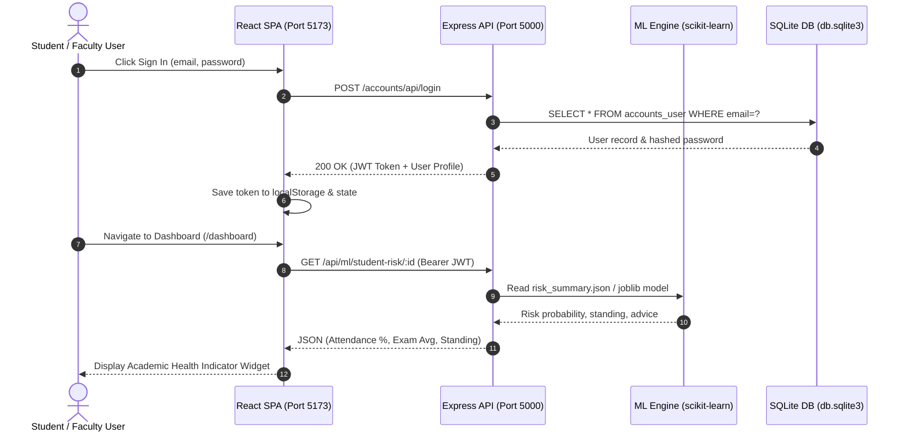

# CampusHub - Comprehensive Code Architecture, Routing & Function Reference Guide

This document provides an end-to-end technical reference for **CampusHub**, covering every imported library, complete routing architecture (Frontend SPA, Django REST API), and a function-by-function breakdown of the codebase.

---

## Table of Contents
1. [Imported Libraries & Dependency Directory](#1-imported-libraries--dependency-directory)
2. [Complete Project Routing Architecture](#2-complete-project-routing-architecture)
3. [End-to-End Data & Request Flow Diagram](#3-end-to-end-data--request-flow-diagram)
4. [Function-by-Function Code Breakdown](#4-function-by-function-code-breakdown)
   - [Frontend (`frontend/src/App.jsx`)](#a-frontend-srcappjsx)
   - [Django Pure REST API Backend (`backend/django/`)](#b-django-backend-backenddjango)
   - [Machine Learning Pipeline (`backend/ml/`)](#c-machine-learning-pipeline-backendml)

---

## 1. Imported Libraries & Dependency Directory

### Frontend Dependencies (`frontend/package.json`)
| Library | Used In | Purpose & Explanation |
| :--- | :--- | :--- |
| `react` | Throughout `src/` | Core UI library for component-based rendering, hooks (`useState`, `useEffect`, `useContext`, `useRef`, `useMemo`). |
| `react-dom` | `src/main.jsx` | Renders React components into the DOM tree (`document.getElementById('root')`). |
| `react-router-dom` | `src/App.jsx` | Client-side routing SPA manager (`BrowserRouter`, `Routes`, `Route`, `Navigate`, `useNavigate`, `Link`, `useLocation`). |
| `vite` | Root build tool | High-performance dev server with Instant Hot Module Replacement (HMR) and production bundling. |
| `@vitejs/plugin-react` | `vite.config.js` | Enables JSX transform and React fast refresh support for Vite. |

### Django & Python Dependencies (`backend/django/` & `backend/ml/`)
| Library | Used In | Purpose & Explanation |
| :--- | :--- | :--- |
| `Django` | `backend/django/` | Full-stack Python framework serving Django HTML templates, Django Admin, and Django ORM models. |
| `djangorestframework` | `backend/django/` | REST framework extension for Django API views and serializers. |
| `scikit-learn` | `backend/ml/train_risk_model.py` | Machine Learning library providing `RandomForestClassifier`, `KNeighborsClassifier`, `LogisticRegression`, `StandardScaler`, and metrics (`accuracy_score`, `f1_score`). |
| `pandas` | `backend/ml/train_risk_model.py` | Data analysis library used to query SQLite tables into DataFrames, merge datasets, aggregate stats, and clean missing values. |
| `numpy` | `backend/ml/train_risk_model.py` | Array numerical processing for risk thresholds and random baseline seeding. |
| `joblib` | `backend/ml/train_risk_model.py` | Serializes and exports trained ML models, scalers, and pipelines to binary `.joblib` files. |

---

## 2. Complete Project Routing Architecture

CampusHub operates with a **pure REST API decoupled architecture**:

```text
Browser Client (User)
       │
       └──► Port 5173 : Vite React Single Page Application (Modern Glassmorphic UI in /frontend)
                 │
                 ├── Proxy `/api/*`          ──► Port 8000 : Pure Django REST API Backend
                 ├── Proxy `/accounts/api/*` ──► Port 8000 : Pure Django REST Auth & User API
                 └── Proxy `/admin/*`        ──► Port 8000 : Django Admin Panel
```

### A. Frontend Routes (`frontend/src/App.jsx`)
All client-side SPA routes managed by `react-router-dom`:

| Client Route | Guard | Component Rendered | Purpose |
| :--- | :--- | :--- | :--- |
| `/` | Public | `<HomePage />` | Main landing page with feature cards, live stats bar, and hero section. |
| `/login` | Public | `<Login />` | Sign in screen for Students, Faculty, and Administrators. |
| `/register` | Public | `<Register />` | Account creation form with role selection (Student / Faculty). |
| `/dashboard` | `PrivateRoute` | `<DashboardLayout><Dashboard /></DashboardLayout>` | Role-aware main dashboard (Student, Faculty, or Admin view). |
| `/profile` | `PrivateRoute` | `<DashboardLayout><UserProfile /></DashboardLayout>` | User profile management, details, and password change. |
| `/courses` | `PrivateRoute` | `<DashboardLayout><Courses /></DashboardLayout>` | Course catalog, student enrollment, and faculty course creation. |
| `/attendance` | `PrivateRoute` | `<DashboardLayout><Attendance /></DashboardLayout>` | Real-time live attendance logging (Faculty) & percentage reports (Student). |
| `/exams` | `PrivateRoute` | `<DashboardLayout><ExamsAndPerformance /></DashboardLayout>` | Exam scheduling, student mark entry, and performance tracking. |
| `/assignments` | `PrivateRoute` | `<DashboardLayout><Assignments /></DashboardLayout>` | Homework posting (Faculty) and online submissions (Student). |
| `/events` | `PrivateRoute` | `<DashboardLayout><Events /></DashboardLayout>` | Campus announcements and event registrations. |
| `/notes` | `PrivateRoute` | `<DashboardLayout><Notes /></DashboardLayout>` | PDF lecture note uploads, downloads, and search. |
| `*` | Catch-all | `<Navigate to="/" replace />` | Redirects any unknown route back to `/`. |

### B. Express Backend API Routes (`backend/express/server.js`)
All JSON API endpoints served on **Port 5000**:

| API Route | Handler File | Endpoint Purpose |
| :--- | :--- | :--- |
| `POST /accounts/api/register` | `routes/auth.js` | Creates new user account & profile record in SQLite. |
| `POST /accounts/api/login` | `routes/auth.js` | Authenticates credentials and returns JWT bearer token. |
| `GET /accounts/api/me` | `routes/auth.js` | Fetches authenticated user identity. |
| `GET /api/courses/` | `routes/courses.js` | Lists all active courses. |
| `GET /api/courses/my-courses` | `routes/courses.js` | Lists courses enrolled by student or taught by faculty. |
| `POST /api/courses/enroll` | `routes/courses.js` | Enrolls student into a course. |
| `GET /api/attendance/percentage/:id` | `routes/attendance.js` | Calculates total attendance % for a student. |
| `POST /api/attendance/mark/:courseId` | `routes/attendance.js` | Faculty logs student attendance for a date. |
| `GET /api/ml/risk-analysis` | `routes/ml.js` | Returns overall academic early warning data & feature impacts. |
| `GET /api/ml/student-risk/:id` | `routes/ml.js` | Returns individual student academic health indicator. |
| `GET /api/assignments` | `routes/notes_events_assignments.js` | Lists homework assignments. |
| `GET /api/notes` | `routes/notes_events_assignments.js` | Lists study notes & PDF attachments. |
| `GET /api/events` | `routes/notes_events_assignments.js` | Lists campus events. |

### C. Django Server Routes (`backend/django/campusHub/urls.py`)
All server-side HTML template routes served on **Port 8000**:

| Django Route | View Function | Template File Rendered | Purpose |
| :--- | :--- | :--- | :--- |
| `/` | `campus_views.home_view` | `templates/home.html` | Server-rendered Django home landing page. |
| `/accounts/login/` | `accounts.views.login_view` | `templates/accounts/login.html` | Django session login form. |
| `/accounts/register/` | `accounts.views.register_view` | `templates/accounts/register.html` | Django registration form. |
| `/courses/` | `courses.views.course_list` | `templates/courses/course_list.html` | Course listing template. |
| `/assignments/` | `assignments.views.assignment_list` | `templates/assignments/assignment_list.html` | Assignments list template. |
| `/events/` | `events.views.event_list` | `templates/events/event_list.html` | Events list template. |
| `/notes/` | `notes.views.note_list` | `templates/notes/note_list.html` | Study notes list template. |
| `/admin/` | `django.contrib.admin.site.urls` | Django Built-in Admin | Raw database admin panel. |

---

## 3. End-to-End Data & Request Flow Diagram



---

## 4. Function-by-Function Code Breakdown

### A. Frontend (`frontend/src/App.jsx`)

#### 1. `getProfilePic(imagePath)`
- **Location**: Top of `App.jsx` (Module Scope)
- **Used By**: `<DashboardLayout />`, `<UserProfile />`
- **What It Does**: Validates whether a profile image string exists and starts with `data:image` or `http`. If valid, returns `imagePath`; otherwise returns `DEFAULT_THEME_AVATAR` (SVG fallback).

#### 2. `AuthProvider({ children })`
- **Location**: Auth context wrapper
- **Used By**: Wraps the entire `<App />` tree inside `<AuthContext.Provider>`
- **What It Does**: Manages global user authentication state (`user`, `token`, `loading`). Automatically validates saved JWT tokens on startup via `fetchUser()`.

#### 3. `fetchUser()`
- **Location**: Inside `AuthProvider`
- **Used By**: `useEffect` on token change
- **What It Does**: Calls `GET /accounts/api/me` with Authorization headers to fetch current user profile. On failure, clears invalid token and logs out.

#### 4. `PrivateRoute({ children, roles })`
- **Location**: Route Guard component
- **Used By**: Wraps protected routes (`/dashboard`, `/courses`, `/attendance`, `/notes`, etc.)
- **What It Does**: Checks if user is authenticated. If not, redirects to `/login`. If user role is not allowed, redirects to `/dashboard`.

#### 5. `HomePage()`
- **Location**: Public landing page component
- **Used By**: Route `/`
- **What It Does**: Displays landing hero header, live stats counters, feature cards, and navigation links.

#### 6. `Login()`
- **Location**: Authentication component
- **Used By**: Route `/login`
- **What It Does**: Renders login form. Sends `POST /accounts/api/login/` with email and password. On success, calls `login(token, user)` and navigates to `/dashboard`.

#### 7. `Register()`
- **Location**: Registration component
- **Used By**: Route `/register`
- **What It Does**: Renders account creation form for Student or Faculty roles. Sends `POST /accounts/api/register/`.

#### 8. `DashboardLayout({ children })`
- **Location**: Main UI container layout
- **Used By**: Wraps all authenticated views
- **What It Does**: Renders sticky sidebar navigation (Home, Dashboard, Profile, Courses, Attendance, Exams, Assignments, Events, Notes, Logout) and places page content in `main-content`.

#### 9. `StudentDashboard()`
- **Location**: Dashboard for Student role
- **Used By**: Rendered inside `Dashboard` when `user.role === 'student'`
- **What It Does**: Fetches enrolled courses, overall attendance %, and announcements board. Renders `<AIStudentRiskWidget />`.

#### 10. `FacultyDashboard()`
- **Location**: Dashboard for Faculty role
- **Used By**: Rendered inside `Dashboard` when `user.role === 'faculty'`
- **What It Does**: Fetches assigned course classes overview and renders `<AIRiskAnalysisPanel />`.

#### 11. `AdminDashboard()`
- **Location**: Dashboard for Admin role
- **Used By**: Rendered inside `Dashboard` when `user.role === 'admin'`
- **What It Does**: Displays system counters, link to Django Admin terminal, and `<AIRiskAnalysisPanel />`.

#### 12. `AIStudentRiskWidget({ userId, token })`
- **Location**: Academic Indicator Widget
- **Used By**: `StudentDashboard`
- **What It Does**: Fetches `/api/ml/student-risk/:id`. Renders simple standing badge ("On Track", "Attention Needed", "Immediate Action Required"), attendance %, exam average, and guidance.

#### 13. `AIRiskAnalysisPanel({ token })`
- **Location**: Early Support Roster Panel
- **Used By**: `FacultyDashboard`, `AdminDashboard`
- **What It Does**: Fetches `/api/ml/risk-analysis`. Displays primary performance factor bars and a roster table of students needing academic attention.

#### 14. `ErrorBoundary`
- **Location**: Top-level Class Component
- **Used By**: Wraps `<AuthProvider>` in `App()`
- **What It Does**: Catches unhandled JavaScript errors in component rendering (`getDerivedStateFromError`) and displays a glassmorphism recovery screen instead of a blank page.

---

### B. Express Backend (`backend/express/`)

#### 1. `server.js`
- **Purpose**: Server entry point (Port 5000).
- **Functions Used**:
  - `app.use(cors())`: Allows cross-origin requests.
  - `app.use(express.json())`: Parses JSON request bodies.
  - `app.use('/media', express.static(...))`: Serves uploaded static files.
  - Route mounts: `/accounts/api`, `/api/courses`, `/api/attendance`, `/api/exams`, `/api/ml`, `/api`.

#### 2. `middleware/auth.js` -> `authenticateToken(req, res, next)`
- **Purpose**: Express middleware.
- **What It Does**: Extracts `Bearer <token>` from HTTP Authorization header, verifies signature using `jsonwebtoken.verify()`, and attaches payload (`req.user`) to request object.

#### 3. `routes/auth.js`
- **`POST /register`**: Inserts new user into `accounts_user` table and creates `accounts_studentprofile` or `accounts_facultyprofile`.
- **`POST /login`**: Checks email in `accounts_user`, verifies password via `bcrypt.compareSync()` or Django PBKDF2 hash, and returns signed JWT token.
- **`GET /me`**: Returns current logged-in user record.

#### 4. `routes/courses.js`
- **`GET /`**: Queries `SELECT * FROM courses_course`.
- **`GET /my-courses`**: Queries courses where student is enrolled or faculty is instructor.
- **`POST /enroll`**: Inserts student into `courses_enrollment`.

#### 5. `routes/attendance.js`
- **`GET /percentage/:id`**: Calculates `present_sessions / total_sessions * 100` for a student.
- **`POST /mark/:courseId`**: Inserts or updates attendance records in `courses_attendance`.

#### 6. `routes/ml.js`
- **`GET /risk-analysis`**: Reads `backend/ml/risk_summary.json` and returns risk factors and student roster.
- **`GET /student-risk/:id`**: Searches `risk_summary.json` for student ID and returns academic health indicators.

---

### C. Django Backend (`backend/django/`)

#### 1. `campusHub/settings.py`
- **Purpose**: Central Django project configuration.
- **Configured Attributes**: `INSTALLED_APPS` (accounts, courses, assignments, events, notes, attendance), `DATABASES` (SQLite `db.sqlite3`), `TEMPLATES` (DIR: `BASE_DIR / 'templates'`).

#### 2. `campusHub/views.py`
- **`home_view(request)`**: Renders Django `home.html` template.
- **`handler404(request, exception)`**: Renders `errors/404.html`.
- **`handler500(request)`**: Renders `errors/500.html`.

#### 3. `accounts/views.py`
- **`login_view(request)`**: Handles Django session login form (`AuthenticationForm`) and renders `accounts/login.html`.
- **`register_view(request)`**: Handles Django user registration and renders `accounts/register.html`.

---

### D. Machine Learning Pipeline (`backend/ml/`)

#### `train_risk_model.py`
- **`load_data_from_db()`**: Connects to `db.sqlite3` using `sqlite3` and queries `accounts_user`, `accounts_studentprofile`, `courses_attendance`, `assignments_submission`, and `courses_exammark` into pandas DataFrames. Aggregates attendance %, assignment avg, and exam avg.
- **`train_and_evaluate()`**:
  - Prepares feature matrix `X` and target `y` (`is_at_risk` = attendance < 75% or exam < 50%).
  - Scales features using `StandardScaler`.
  - Fits 3 models: **Random Forest Classifier** (`n_estimators=100`), **K-Nearest Neighbors Classifier** (`n_neighbors=5`), and **Logistic Regression**.
  - Calculates accuracy, precision, recall, F1-score, and Random Forest feature importances.
  - Generates student risk probability scores.
  - Exports trained model binary to `backend/ml/risk_model.joblib` and JSON evaluation data to `backend/ml/risk_summary.json`.
